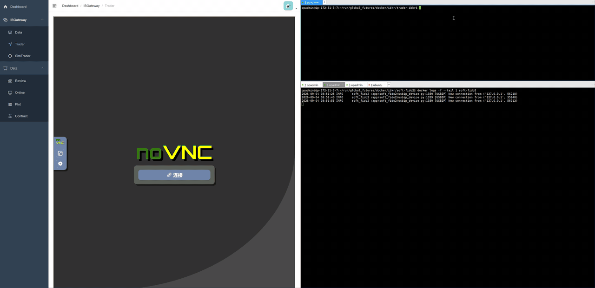

# ibga-docker

[中文](README.md) · [English](README.en.md)

> **Forked from** [heshiming/ibga](https://github.com/heshiming/ibga) (GPLv3)。
> `upstream` 远程指向该上游项目；本仓库在其基础上做了容器化、CI/CD、双通道镜像与 Passkey 无人值守登录等工程化增强。

把盈透证券 IB Gateway 装进 Docker 容器的一行启动方案，实现 **7×24 小时无人值守**运行。

> 镜像：`ghcr.io/huieric/ibkr` · 协议：GPLv3 · 仓库：[github.com/huieric/ibga-docker](https://github.com/huieric/ibga-docker)

### 登录演示

下图是在 noVNC 里录制的完整登录流程：容器启动 → 自动填写账号密码 → Passkey 认证 → 登录成功 → 导出日志。（账号已打码）



---

## 它解决了什么问题

IB Gateway 是连接量化策略与 IBKR 账户的桥梁，但它有几个传统痛点：

| 痛点 | 说明 |
|------|------|
| 必须有图形界面 | Java GUI 程序，无法在纯命令行服务器运行 |
| 每天强制重启 | IBKR 每日定时断线重启，策略会中断 |
| 每周强制登出 | 超一周不重登会被踢下线 |
| 强制 Passkey 认证 | IBKR 现已要求 Passkey，无法手工操作 |
| Paper/Live 弹窗 | 模拟交易每次启动都有确认弹窗 |

ibga-docker 用「Docker 容器 + 自动化脚本」把这些痛点一次性解决。

---

## 架构

```
┌───────────────────────────────────────────────────┐
│                  容器 (ibga)                        │
│                                                     │
│  ┌───────┐   ┌───────────┐   ┌─────────────────┐  │
│  │ Xvfb  │──▶│  noVNC    │   │  Bash 自动化脚本 │  │
│  │虚拟显示│   │(浏览器监控)│   │  (登录/重启/维护)│  │
│  └───────┘   └───────────┘   └────────┬────────┘  │
│       │                                │           │
│       ▼                                ▼           │
│  ┌────────────────────────┐  ┌──────────────────┐  │
│  │   IB Gateway (Java)    │◀─│  JAuto + xdotool  │  │
│  │   内嵌 Chromium (JxBr.) │  │  UI 定位 + 模拟输入│  │
│  └───────────┬────────────┘  └──────────────────┘  │
└──────────────┼──────────────────────────────────────┘
               │ TCP 8888 (socat → 4001)
               ▼
        你的策略程序 (TWS API / ib_insync)
```

---

## 核心能力

### 无人值守登录
- **Passkey 自动登录（默认）**：配合独立容器 [`soft-fido2`](https://github.com/huieric/soft-fido2)（软件安全密钥，经 USB/IP 呈现为真实 USB 设备），自动点击 Authenticate 完成登录，无需实体 USB Key、无需人工操作
- **TOTP 自动登录（旧）**：`AUTH_METHOD=totp` 时由 `oathtool` 自动生成并填入 6 位码（IBKR 已不再对新账户提供该选项）

> 认证方式由 `AUTH_METHOD` 环境变量控制，`passkey`（默认）与 `totp` 二选一互斥。

### 稳定性
- **每日自动重启**：按 `IB_LOGOFF` 时间自动完成断线重连
- **崩溃自动恢复**：容器级 `restart: unless-stopped` + 脚本级进程检测双重保障
- **健康检查**：内置 healthcheck，`docker ps` 直接可见 `healthy` 状态
- **日志自动导出**：`IBGA_EXPORT_LOGS=true` 每日导出 Gateway / API 日志

### 易用性
- **容器可丢弃**：程序与设置挂载宿主机，升级/迁移零丢失
- **双通道版本**：`stable`（生产）/ `latest`（测试）两条镜像 tag
- **CI/CD 自动构建**：IBKR 发新版本即自动检测、构建、发布，升级只需 `docker compose pull`
- **内置 Chromium**：可在容器内直接打开 IBKR Client Portal（例如注册 passkey）

---

## 快速开始

```yaml
# docker-compose.yml
services:
  my-ibga:
    image: ghcr.io/huieric/ibkr:stable
    restart: unless-stopped
    environment:
      - IB_USERNAME=your_username
      - IB_PASSWORD=your_password
      - IB_TIMEZONE=Asia/Shanghai
      - IB_LOGINTAB=IB API
      - IB_LOGINTYPE=Live Trading     # 或 Paper Trading
      - IB_LOGOFF=05:30 AM            # 每日重启时间
      - AUTH_METHOD=passkey           # 默认即 passkey，可省略
    volumes:
      - ./run/program:/home/ibg             # IB Gateway 程序目录
      - ./run/settings:/home/ibg_settings   # 用户设置目录
    ports:
      - "8888:8888"    # IB API 端口（socat 转发）
      - "6080:6080"    # noVNC 浏览器界面（监控/调试）
```

```bash
docker compose up -d
# 浏览器打开 http://服务器IP:6080 查看 Gateway 实时运行状态
```

策略连接：

```python
import ib_insync
ib = ib_insync.IB()
ib.connect('127.0.0.1', 8888, clientId=1)
```

---

## 环境变量

完整参数说明见 [`docs/references/config-args.md`](docs/references/config-args.md)。核心项：

| 变量 | 必填 | 说明 |
|------|:---:|------|
| `IB_USERNAME` | ✅ | IB 账户用户名 |
| `IB_PASSWORD` | ✅ | IB 账户密码 |
| `IB_TIMEZONE` | ✅ | 时区（TZ 数据库名，如 `Asia/Shanghai`） |
| `IB_LOGINTAB` | ✅ | `IB API` 或 `FIX CTCI` |
| `IB_LOGINTYPE` | ✅ | `Live Trading` 或 `Paper Trading` |
| `IB_LOGOFF` | ✅ | 每日重启时间，格式 `HH:MM AM/PM` |
| `AUTH_METHOD` | — | 认证方式 `passkey`（默认）/ `totp`（旧） |
| `TOTP_KEY` | — | 仅 `AUTH_METHOD=totp` 时使用 |
| `IB_REGION` | — | `America` / `Europe` / `Asia` / `China` |
| `IB_APILOG` | — | API 消息日志：空 / 任意值 / `data` |
| `IB_LOGLEVEL` | — | `System` / `Error` / `Warning` / `Info` / `Detail` |
| `IBGA_EXPORT_LOGS` | — | `true` 时每日导出日志 |
| `IBGA_LOG_EXPORT_DIR` | — | 日志导出目录 |

---

## Passkey 无人值守登录（与 soft-fido2 协作）

IBKR 现强制 Passkey 认证。本仓库提供两段式方案：

| 组件 | 仓库 | 职责 |
|------|------|------|
| `soft-fido2` 容器 | [huieric/soft-fido2](https://github.com/huieric/soft-fido2) | 导入 passkey 私钥，经 USB/IP 呈现为真实 USB 设备 |
| IBGA 容器 | 本仓库 | 自动登录 + 点击 Authenticate（`AUTH_METHOD=passkey`） |

数据流：

```
soft-fido2 容器 (network_mode: host, :3240)
     │ USB/IP 协议
     ▼
宿主机 usbip attach (vhci-hcd) → 真实 USB 设备 /dev/bus/usb/xxx/yyy
     │ bind mount /dev/bus/usb + cgroup 'c 189:* rwm'
     ▼
IBGA 容器 → IB Gateway（内嵌 Chromium 枚举到密钥）→ 签名登录
```

完整配置步骤见 [FAQ](docs/faq.md#how-to-setup-unattended-passkey-software-security-key-login)。

> **容器内置 Chromium**：便于在容器内打开 Client Portal 注册 passkey。容器内不装 Firefox（其 WebAuthn 路由会强制 transports 规则，拦截 USB/IP passkey）。

---

## 安全须知

- **不要将 API 端口暴露到公网**：IB Gateway API 是无认证裸 TCP，建议绑定 `127.0.0.1`
- **敏感信息**：生产环境建议用 Docker secrets 或 `.env`，不要直接写死在 compose 文件里
- 详细安全建议见 [`docs/references/security.md`](docs/references/security.md)

---

## 升级

```bash
docker compose pull      # 拉取新镜像
docker compose up -d     # 重建容器（程序与设置通过 volume 保留）
```

---

## 许可

GPLv3。详见 [LICENSE](LICENSE)。
